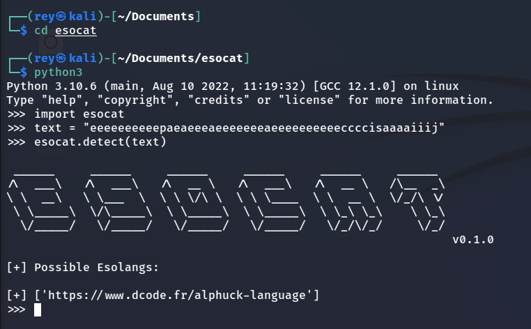
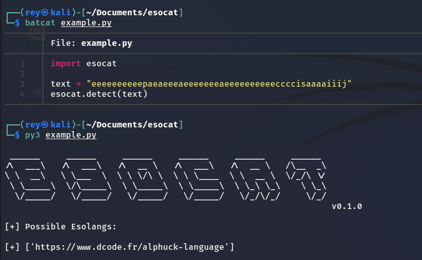

# **Esocat**
#### _The EsoLang Detector_

 [](https://github.com/r3yc0n1c/esocat/blob/main/LICENSE) 

Tired of Esolangs? Try Esocat!

Esocat is a Python program that detects the annoyling Esolangs for you and shows you the best interpreter.

## Features

* Detect Esoteric programming languages of any pattern.
* Predicts the best interpreter.

## Supported Esolangs
- Malbolge
- Brainfuck
- Reversefuck
- Spoon
- Binaryfuck
- Deadfish
- Ook!
- Jsfuck
- COW
- Pikalang
- Alphuck

## Installation
```bash
$ git clone https://github.com/r3yc0n1c/esocat.git
$ cd esocat
```
## Usage
#### From Terminal

#### As a python module


## Contribution
Pull requests are welcome. For major changes, please open an issue first to discuss what you would like to change.

Please make sure to update tests as appropriate.

## License
Licensed under the MIT License, see [LICENSE](./LICENSE) for more information.

## Contact
Author - [r3yc0n1c](https://github.com/r3yc0n1c) | [@r3yc0n1c](https://twitter.com/r3yc0n1c) | 0xsr1337@gmail.com

## Acknowledgments
- https://esolangs.org/wiki/Language_list
- https://esolangs.org/wiki/Joke_language_list
- https://www.dcode.fr/en